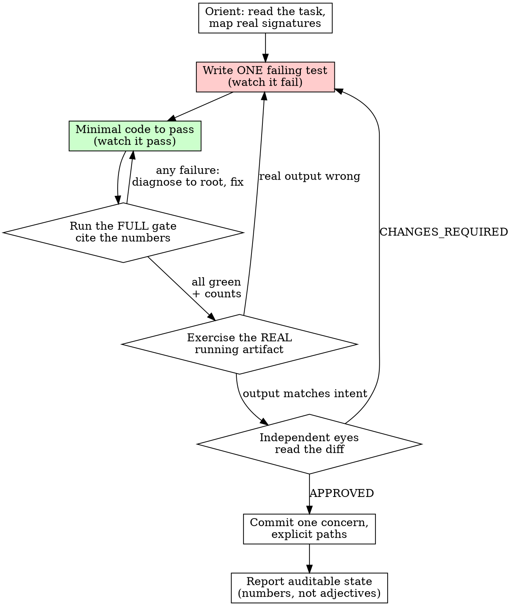

# Disciplined Implementation

## Overview

A portable delivery loop for any substantial coding task. It assumes nothing about your language, framework, repo layout, or harness.

**Core principle:** Never trust an abstraction you haven't watched fail, never ship output you haven't seen run, never duplicate what you could share, and always leave an auditable trail.

**Violating the letter of this loop is violating the spirit of it.**

This skill is the *orchestrating loop*. It does not restate the disciplines it depends on — it tells you when to invoke them:

- **REQUIRED SUB-SKILL:** superpowers:test-driven-development — the RED→GREEN mechanics for every behavior change.
- **REQUIRED SUB-SKILL:** superpowers:verification-before-completion — evidence before any completion claim.
- For hard failures during the loop: superpowers:systematic-debugging.
- For a review before shipping: superpowers:requesting-code-review (or requesting-deep-review for senior-level).
- For multi-subsystem work: superpowers:writing-plans (and brainstorming first if the design is open).

## When to Use

- New features, bug fixes, refactors, behavior changes — anything where code lands.
- Investigating an unfamiliar codebase before changing it.

**Not for:** throwaway one-liners, generated files, or pure config — use judgment.

## The Loop



## The Two Non-Negotiables

Baseline testing (capable agents, no skill, 6/6) showed two disciplines get skipped on an ordinary ticket. These are where the loop earns its keep.

### 1. A failing test before the behavior — every time

New behavior gets a test that you **wrote first and watched fail**, before the implementation edit. A manual smoke run is not a test — it leaves no regression guard. Pin each branch (success / error / empty / degraded) with its own test.

Follow superpowers:test-driven-development for the mechanics. The Iron Law holds here: **no production code without a failing test first.**

### 2. The full gate before every commit — with numbers

Before **every** commit, run your project's complete gate — type-check/compile, lint, build, and the test suite — and cite the numeric result ("lint: 0 errors, build: ok, 214 tests pass"). Not "green." Not just the tests.

- Lint means **zero** errors, not zero *new* errors.
- Diagnose every gate failure to root cause before fixing. Suspect "pre-existing"? Verify against the clean/base tree before trusting that claim.
- Stay fast with targeted runs during the task; run the full gate at commit boundaries.

This is superpowers:verification-before-completion applied at the commit boundary.

## The Rest of the Loop

**Orient before touching code.** Read the task and any design docs. Enumerate before reading deep — search for the symbol to map call sites, then read only the ranges you need. Trace each chain to its source (caller → implementation → definition → data/schema); at an interface boundary verify the contract on both sides. Track the work as discrete items in your harness's task tool.

**Ground multi-part plans in reality.** Gather real signatures, types, and integration points — don't plan from memory of an API. Decompose into named, numbered phases, each shipping something testable; write a phase's detailed plan only once the previous phase has landed.

**Extract before you duplicate.** Before implementing a pattern, search whether it already exists. If it does, reuse or extract one shared unit and migrate both consumers first — on first sight, not after a reviewer flags it.

**Verify the real artifact, not just the abstraction.** Tests and types prove the abstraction; they don't prove the running thing. Before declaring done, exercise the actual output — hit the running service, render the UI and look at it, open the produced file, query the real datastore for shape and cardinality. Match test fixtures to real data shapes, not invented ones.

**Review with independent eyes, then ship.** Don't review your own work in the same mindset — dispatch a read-only reviewer, or review from a clean, deliberately critical context. Read the diff line by line; green tests are necessary, not sufficient. Commit **one logical concern, staging explicit file paths** — never `git add -A` / `git add .` / broad subtree adds; they sweep unintended files. Write a message that explains WHY. Don't push unless asked. Keep a living decision/audit log so any future contributor can reconstruct the state.

## Communicate Throughout

- Report exact, auditable state after each step: counts, gate status, commit hash, next action — **numbers, not adjectives.**
- Surface blockers immediately, named by type and by who must resolve them (a decision, a credential, a permission, a scope question).
- When the reviewer disagrees, reframe rather than defend: acknowledge, sharpen into a constraint, propose grounded alternatives.
- Flag uncertainty explicitly; "code I didn't read" is not "code that doesn't exist."

## Rationalizations — STOP

Several of these were produced verbatim by agents in baseline testing; the rest surfaced under pressure testing or are carried from the source method as preventive.

| Excuse | Reality |
|--------|---------|
| "The ticket didn't ask for tests" | Tickets specify outcomes, not process. New behavior needs a test that failed first. |
| "A manual run was sufficient" | A smoke run leaves no regression guard. The next change breaks it silently. |
| "The existing test file only covers X" | That gap is the thing to close, not a license to skip. |
| "Tests passed, so it's done" | Tests are not the full gate. Run lint + build + test and cite the numbers. |
| "Lint/build are unrelated to my change" | The gate runs as one unit before every commit. Zero errors, not zero new errors. |
| "It's a small change" | Small changes break builds and ship type errors. The gate is cheap. |
| "No time — the deadline/demo is now" | The gate runs in seconds; a regression shipped under deadline costs hours. Pressure is exactly when discipline matters most. |
| "The suite is already green, skip the new test" | Green-without-your-test means the new behavior is uncovered. That's when the test matters most. |
| "This failure looks pre-existing" | Verify it against the clean/base tree before you say so. |
| "I'll just `git add -A`, it's faster" | Broad adds sweep stray files. Stage explicit paths. |

## Red Flags — STOP and Restart the Step

- About to commit having run only the tests (not lint + build)
- Writing implementation before a failing test exists
- "manual run was enough" / "the ticket didn't ask for a test"
- Saying "done" / "works" / "looks good" without citing gate numbers
- `git add -A` / `git add .` / broad subtree add
- Marking done from green tests without exercising the real running artifact
- Trusting your own change because tests pass (no independent diff read)
- "pre-existing failure" said without checking the base tree
- Reimplementing a pattern that already exists elsewhere
- Pushing because it's "done" — push only when asked

**All of these mean: stop, return to the relevant step, do it for real.**

## The Bottom Line

```
Behavior change → a test failed first
Before every commit → full gate, cited in numbers
Before "done" → the real artifact ran and independent eyes read the diff
```

Otherwise, it isn't disciplined — it's hope with a commit message.
